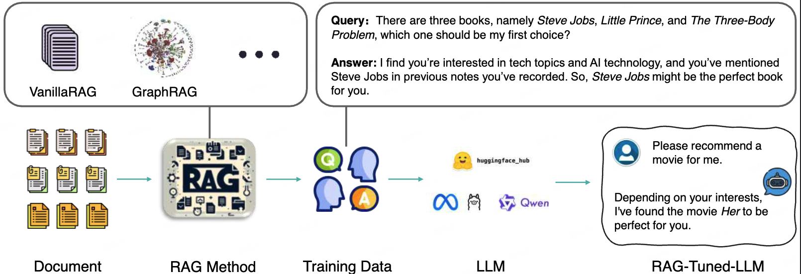

# Tuning LLMs by RAG Principles: Towards LLM-native Memory

> By Jiale Wei, Shuchi Wu, Ruochen Liu, Xiang Ying, Jingbo Shang, Fangbo Tao

This repo is the official implementation of "**Tuning LLMs by RAG Principles: Towards LLM-native Memory**".

<figure>
<p align="center" >

</p>
</figure>

## Installation

We recommend you to use:
```
pip install requirements.txt -r
``` 
to install related packages.

## Data preparation

First, refer to `./graphrag/` to set your graphrag environment and get entities, relations and text units.

For each dataset, we provide scripts to generate global (entities & relation) and local (text units) training data.

## Train Set Generation

In `./train_data_prep/`, we provide codes of train set generation.

## Test Set Generation

In `./test_data_prep/`, we provide codes of test set generation and how we let long-context LLM respond our test questions.

In each folder, the test data are generated following the process of data filtering, description generation, users & tasks generation and query generation.

## Evaluation

In `./evaluation/`, we provide codes of evaluation and some implementation of baseline approaches.

Given two competitors and related context, `eval_news.py` and `eval_podcast.py` can help you find out the winner in comparison.

